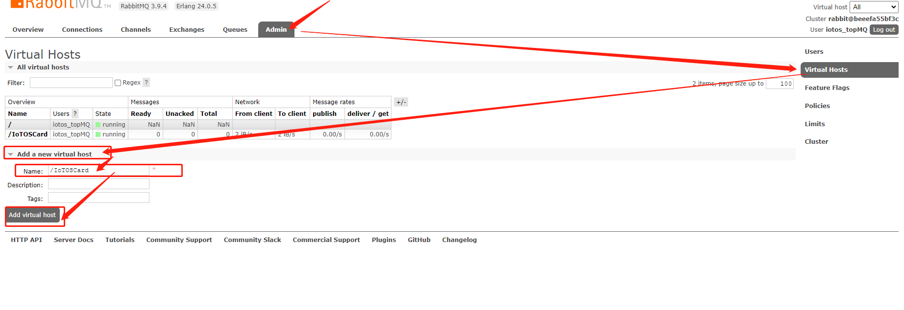
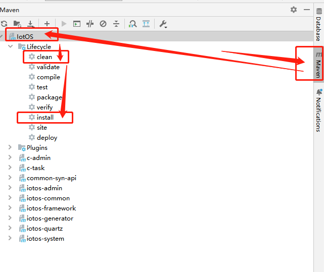
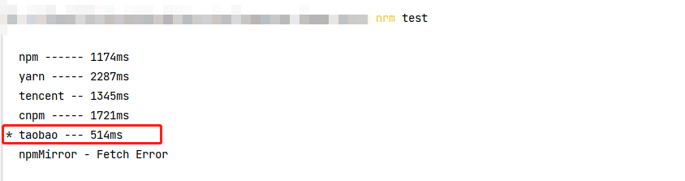

# 部署服务 {#deployment-service}


::: tip 提示
如果 您需要快速构建系统可以联系我们，获取云镜像快速搭建服务（该方式会收取一定费用）；

当然 我们为您提供了免费 服务搭建教程文档 供开发者部署运行。
:::


## 1 服务器配置{#server-configuration}

建议服务器最低配置：

| 类型 | 配置 |
|:-:|:-:|
|操作系统|CentOS8|
|CPU|4核|
|内存|8G|
|带宽|5M|
|硬盘|50G|

::: tip 提示
如果 需要在 Windows 系统部署 消耗系统内存与CPU需要的配置会更高；

推荐使用 Linux 操作系统配置。
:::


## 2 项目依赖插件说明{#Lai-plug-in-description}


程序依赖插件

| 名称 | 版本 | 说明 |
|:-:|:-:|:-:|
|Mysql|8.0|最低5.7版本，推荐使用8.0|
|Redis|6.2|缓存服务|
|Nginx|1.2.0|代理服务|
|RabbitMq|3.9.4|MQ消息队列|
|JDK|1.8|Java程序依赖|

::: tip 注意
搭建案例中 Mysql 为 8.0 版本，SQL文件执行也为8.0版本

执行5.7版本会出现语法不兼容等问题！！！请尽量按配置标准搭建服务

或 联系我们 使用云镜像搭建。
:::

## 3 插件安装&环境配置{#plugin-installation}

## 3.1 安装宝塔{#install-pagoda}

::: tip 提示
教程使用宝塔快速安装插件
快捷安装 Mysql、Redis、Nginx、Docker 等
:::

> 如果您的服务器 有多块磁盘且需要将宝塔的程序和后续的日志都放在该硬盘中，如： `/mnt` 或 `/home` (如没有其他盘或不需要切换安装目录跳至 3步骤)

**如大空间磁盘目录 /mnt 举例**

> 切换到 大空间磁盘目录

 ```bash
cd /mnt
```

1 创建宝塔面板安装需要用到的 `www` 目录

 ```bash
mkdir www
```

2.建立 /mnt/www 软链接到 /www （给系统根目录建立一个www 的 “快捷方式”指向 /mnt/www）

 ```bash
cd /

ln -s /mnt/www /www
```


3.使用 SSH 连接工具 连接到您的 Linux 服务器 挂载磁盘开始安装：

[宝塔linux官方安装教程](https://www.bt.cn/new/download.html#linux)

Centos安装脚本 （本教程使用该方式）

```bash
yum install -y wget && wget -O install.sh https://download.bt.cn/install/install_6.0.sh && sh install.sh ed8484bec
```

Ubuntu/Deepin安装脚本

```bash
wget -O install.sh https://download.bt.cn/install/install-ubuntu_6.0.sh && sudo bash install.sh ed8484bec
```

Debian安装脚本

```bash
wget -O install.sh https://download.bt.cn/install/install-ubuntu_6.0.sh && bash install.sh ed8484bec
```

::: tip 提示
安装成功之后会打印出 你的服务器访问地址和账户密码 ；也可在控制台 输入 `bt` 命令 获取
根据您的服务器宝塔地址访问登录，登录之后需要绑定账号
:::

## 3.2 安装插件Mysql{#install-mysql}

找到左侧目录 [软件商店] > 应用搜索 Mysql 找到右侧 操作 点击  `安装` ,之后 打开首页展示 开关

## 3.3 安装插件Redis{#install-redis}

找到左侧目录 [软件商店] > 应用搜索 Redis 找到右侧 操作 点击  `安装` ,之后 打开首页展示 开关

## 3.4 安装插件Nginx{#install-nginx}

找到左侧目录 [软件商店] > 应用搜索 Nginx 找到右侧 操作 点击  `安装` ,之后 打开首页展示 开关

## 3.5 安装插件Docker{#install-docker}

找到左侧目录 [软件商店] > 应用搜索 Docker 找到右侧 操作 点击 `安装` 之后 打开首页展示开关

## 3.6 开放端口号{#open-port-number}

::: tip 提示
如果您是云服务器 需要先在云平台打开需要开放的端口号
:::

[安全] > 防火墙 放行端口

 ```text
3306  MySQL服务默认端口	
6379  Redis
5672  RabbitMq
15672 RabbitMq
80    网页访问（默认都是开放的可能会更具不同的云厂商未备案会不开放 等）
```

## 3.7 配置Mysql{#config-mysql}

宝塔网站 左侧目录 首页 > 左下角 软件 点击 MySQL 找到 `配置修改`

> 找到 `sql-mode` 修改为如下部分
> 
```text
 sql-mode=NO_ENGINE_SUBSTITUTION,STRICT_TRANS_TABLES
```

点击 `保存` 找到 》 服务 再点击 `重启` mysql 即可 

## 3.8 配置Nginx{#config-nginx}

配置之前需要准备备案域名 如 demo.iotos.top 并指定解析到您的服务器

宝塔面板 左侧目录 首页 > 左下角 软件 点击 Nginx 找到 `配置修改`


复制如下文件 粘贴 点击 `保存` 找到 服务 再 点击 `重启` Nginx 

```text
user  www www;
worker_processes auto;
error_log  /www/wwwlogs/nginx_error.log  crit;
pid        /www/server/nginx/logs/nginx.pid;
worker_rlimit_nofile 51200;

stream {
    log_format tcp_format '$time_local|$remote_addr|$protocol|$status|$bytes_sent|$bytes_received|$session_time|$upstream_addr|$upstream_bytes_sent|$upstream_bytes_received|$upstream_connect_time';
  
    access_log /www/wwwlogs/tcp-access.log tcp_format;
    error_log /www/wwwlogs/tcp-error.log;
    include /www/server/panel/vhost/nginx/tcp/*.conf;
}

events
    {
        use epoll;
        worker_connections 51200;
        multi_accept on;
    }

http
    {
        include       mime.types;
		#include luawaf.conf;

		include proxy.conf;

        default_type  application/octet-stream;

        server_names_hash_bucket_size 512;
        client_header_buffer_size 32k;
        large_client_header_buffers 4 32k;
        client_max_body_size 50m;

        sendfile   on;
        tcp_nopush on;

        keepalive_timeout 60;

        tcp_nodelay on;

        fastcgi_connect_timeout 300;
        fastcgi_send_timeout 300;
        fastcgi_read_timeout 300;
        fastcgi_buffer_size 64k;
        fastcgi_buffers 4 64k;
        fastcgi_busy_buffers_size 128k;
        fastcgi_temp_file_write_size 256k;
		fastcgi_intercept_errors on;

        gzip on;
        gzip_min_length  1k;
        gzip_buffers     4 16k;
        gzip_http_version 1.1;
        gzip_comp_level 2;
        gzip_types     text/plain application/javascript application/x-javascript text/javascript text/css application/xml;
        gzip_vary on;
        gzip_proxied   expired no-cache no-store private auth;
        gzip_disable   "MSIE [1-6]\.";

        limit_conn_zone $binary_remote_addr zone=perip:10m;
		limit_conn_zone $server_name zone=perserver:10m;

        server_tokens off;
        access_log off;

server
    {
        listen 888;
        server_name phpmyadmin;
        index index.html index.htm index.php;
        root  /www/server/phpmyadmin;

        #error_page   404   /404.html;
        include enable-php.conf;

        location ~ .*\.(gif|jpg|jpeg|png|bmp|swf)$
        {
            expires      30d;
        }

        location ~ .*\.(js|css)?$
        {
            expires      12h;
        }

        location ~ /\.
        {
            deny all;
        }

        access_log  /www/wwwlogs/access.log;
    }
    
    
      server{
       listen       80;  #监听端口
       server_name demo.iotos.top;

       location / {
           root iotos;
           index  index.html;
           try_files $uri $uri/ /index.html; 
   			}
   	
		   	location /prod-api/ {
		   		proxy_set_header Host $http_host;
					proxy_set_header X-Real-IP $remote_addr;
					proxy_set_header REMOTE-HOST $remote_addr;
					proxy_set_header X-Forwarded-For $proxy_add_x_forwarded_for;
		   		proxy_pass http://localhost:8080/;
		   	}
   	

  		}
  		
    
    
include /www/server/panel/vhost/nginx/*.conf;
}

```

## 3.9 安装RabbitMQ{#install-rabbitmq}

> SSH 连接工具 连接到您的 Linux 来到终端面板 输入

```bash
docker pull rabbitmq:3.9.4-management
```

> 查看镜像

```bash
docker images
```

> 创建rabbitmq容器

```bash
docker run -d --restart=always --name iotos-rabbit -e RABBITMQ_DEFAULT_USER=iotos_topMQ -e RABBITMQ_DEFAULT_PASS=iotos_topMQ -p 15672:15672 -p 4369:4369 -p 5671-5672:5671-5672 -p 15671:15671 -p 25672:25672 rabbitmq:3.9.4-management
```

## 3.10 安装安装JDK1.8{#install-jdk}

您需要下载JDK压缩包 如 dk-8u271-linux-x64.tar.gz [dk-8u271-linux-x64.tar.gz](https://www.jb51.net/softs/551521.html#downintro2)

> 创建 `/var/java` 

```bash
cd /

mkdir  /var/java
```

> 切换到  `/var/java` 目录将下载的 `jdk` 上传至文件夹下

```bash
cd /var/java
```

> 解压

```bash
tar -zxvf jdk-8u271-linux-x64.tar.gz
```

> 配置环境变量 进入 `/etc`  目录找到 文件`profile` 

```bash
cd /etc
```

>  目录下找到 文件`profile`  下载到本地 进行编辑 在最后 追加如下代码块

```bash


export JAVA_HOME=/var/java/jdk1.8.0_271
export CLASSPATH=.:$:CLASSPATH:$JAVA_HOME/lib/
export PATH=$PATH:$JAVA_HOME/bin
```

>  保存后上传至原目录  `/etc` 刷新配置文件

```bash
source /etc/profile
```

> 查看java版本号

```bash
java -version
```

::: tip 提示
输出版本号时JDK已配置完成 下方举例不需要在控制台中输入！！！
:::

```text
java version "1.8.0_271"
Java(TM) SE Runtime Environment (build 1.8.0_271-b09)
Java HotSpot(TM) 64-Bit Server VM (build 25.271-b09, mixed mode)
```

## 4 配置RabbitMQ{#config-rabbitmq}

## 4.1 登录RabbitMQ{#login-rabbitmq}

::: tip 提示
- serverIp  = 您服务器的ip地址
  使用浏览器打开web管理端：http://serverIp:15672

输入设置的 账号 iotos_topMQ  密码 iotos_topMQ 登录
:::

## 4.2 新增虚拟主机{#add-virtual-host}

切换至 `Admin` 菜单 点击 右侧 `Virtual Hosts`  填写虚拟主机名称 确认新增

 ```text
Name:  /IoTOSCard

点击 Add virtual Hosts 
```




## 5 导入数据库{#import-database}

## 5.1 新建数据库{#new-database}

登录 宝塔面板 查看数据库密码

::: tip 查看数据库密码
登录 宝塔 面板

登录后点击 目录 `数据库` > 点击 按钮 `添加数据库` 填写如下信息

数据库名 iotos_top utf8mb4

数据库名 iotos_top

密码 iotos_top

选择访问权限为 所有人 (如线上环境可更具需要指定可访问IP地址)

数据库名称、账号、密码可更具自行需要修改，首次部署测试时不建议直接修改配置信息。
:::

## 5.2 导入数据库文件{#import-database-file}

> 项目目录 `sql` 下找到 `首次部署执行` 下的 .sql 文件 运行导入


## 6 部署jar包{#deploy-the-jar-package}

## 6.1 创建目录放置 jar{#create-directory}

```bash
cd /mnt

mkdir  runIoTOSJar

cd /mnt/runIoTOSJar
```

## 6.2 Maven打包{#maven-bulid}

> 找到 `IotOS`


1.点击 clean 清空已打包的数据 等待执行完成 

2.再点击 install 项目打包 等待执行完成 



## 6.3 上传jar包{#upload-jar}

> 将已打包的 jar 上传至 `/mnt/runIoTOSJar`

## 6.4 启动命令{#start-command}


::: tip 说明
- -Xms  = 启动时 初始化内存 -Xms128m =  启动时初始化内存占用 128MB

- -Xmx  = 启动后 最大占用内存 -Xmx512m = 启动后最大占用内存 512MB 

PS:可根据实际情况酌情调整 
:::

::: tip 非首次启动
需查看当前运行的进程 将进程关闭后再执行
:::

```bash
# 查看当前 java 程序执行进程 
ps -ef |grep java

# 强制杀死进程 
kill -9 进程号 进程号
```

::: tip 首次启动须知：

启动时 执行启动 `iotos-admin.jar` 后 跳转至 [部署前端](#_7-1-打包-iotos-ui) 执行完再来执行 其他jar包 运行指令

【系统监控】》 (定时任务) 搜索任务名 `RabbitMQ初始化` 点击 `执行一次` 进行 RabbitMQ 队列初始化

未执行 `RabbitMQ初始化` 会导致 其他需要监听队列的程序启动错误。
:::

```bash
#启动前切换至 根目录
cd /

#查看当前目录
pwd

# 启动 iotos-admin.jar （主程序）
nohup /var/java/jdk1.8.0_271/bin/java -Xms128m -Xmx512m -jar /mnt/runIoTOSJar/iotos-admin.jar >/dev/null 2>&1&

# 启动 c-admin.jar （主程序 队列执行消费者）
nohup /var/java/jdk1.8.0_271/bin/java -Xms128m -Xmx512m -jar /mnt/runIoTOSJar/c-admin.jar >/dev/null 2>&1&

# 启动 c-task.jar （定时任务 队列执行消费者）
nohup /var/java/jdk1.8.0_271/bin/java -Xms128m -Xmx512m -jar /mnt/runIoTOSJar/c-task.jar >/dev/null 2>&1&

```

::: tip 是否正常启动？
如果执行的 jar 均在进程中 说明启动成功
:::

 ```bash
# 查看 java 程序执行进程
ps -ef |grep java
```

> 也可根据 查看日志详细信息查看是否启动成功

> 日志默认路径为 `/mnt/iotos/logs` 该路径会随启动时路径变更 故此务必按流程启动 切换至根目录 `cd /` 

```
mnt/iotos/logs     
├── iotos-admin                    
│       └── iotos-admin.log                     // 当天执行文件 过了当天命名为 iotos-admin-2023-01-01.log
├── c-admin                    
│       └── c-admin.log                         // 当天执行文件 过了当天命名为 c-admin-2023-01-07.log
├── c-task                    
│       └── c-task.log                          // 当天执行文件 过了当天命名为 c-task-2023-01-07.log
```

## 6.5 日志查看{#log-view}


```bash
# 查看前切换至 根目录
cd /

# 查看当前目录
pwd

# 查看日志 iotos-admin.jar （主程序）
tail -f /mnt/iotos/logs/iotos-admin/iotos-admin.log

# 查看日志 c-admin.jar （主程序 队列执行消费者）
tail -f /mnt/iotos/logs/c-admin/c-admin.log

# 查看日志 c-task.jar （主程序 队列执行消费者）
tail -f /mnt/iotos/logs/c-task/c-task.log
```

> 退出查看 `Ctrl+c`

## 7 部署前端{#deploy-ui}

## 7.1 打包 iotos-ui{#bulid-ui}

> npm 配置国内站点下载 源管理器安裝

```bash
# 安裝 nrm 源管理器
npm i nrm -g

# 查看可用npm源 站点
nrm ls 

# 测试下载源网速 (该过程会执行一会儿)
nrm test 

# 选择一个测试毫秒数最快的 如 taobao
nrm use taobao
```



> 打开目录 `iotos-ui`

```text
# npm 引入包
npm i

# 构建生产环境 
npm run build:prod
```

命令执行完成后 查看 `iotos-ui` 下 `dist` 目录 此目录为打包后 前端界面

打开远程工具 找到 Nginx 路径，如果您是按流程走到次步骤可直接切换至目录

或找到宝塔按住目录/www/server/nginx

 ```bash
cd /mnt/www/server/nginx

# 创建文件夹
mkdir iotos

# 切换至目录 iotos
cd /mnt/www/server/nginx/iotos
```

`dist` 目录下文件 上传至 `/mnt/www/server/nginx/iotos` 

## 8 开始访问{#start-access}

浏览器 输入您的ip地址 或 配置的域名 如 `demo.iotos.top`

登录名 admin  密码 iotos.top
