# 项目截图 {#projectDisplay}

## IoTOS PC端 {#iotos-pc}

## 登录页{#pc-login}

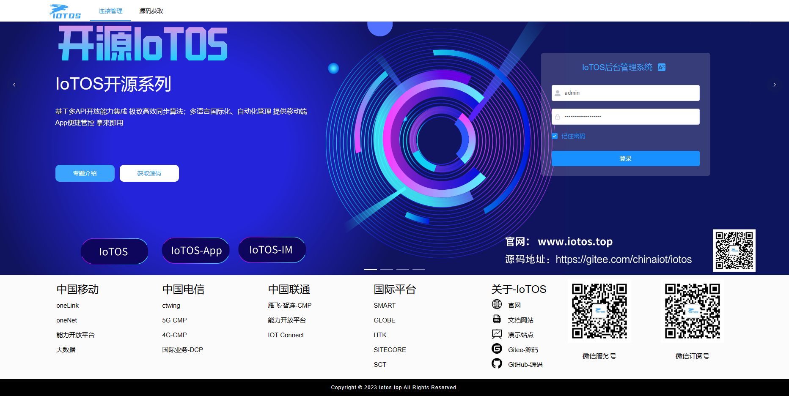

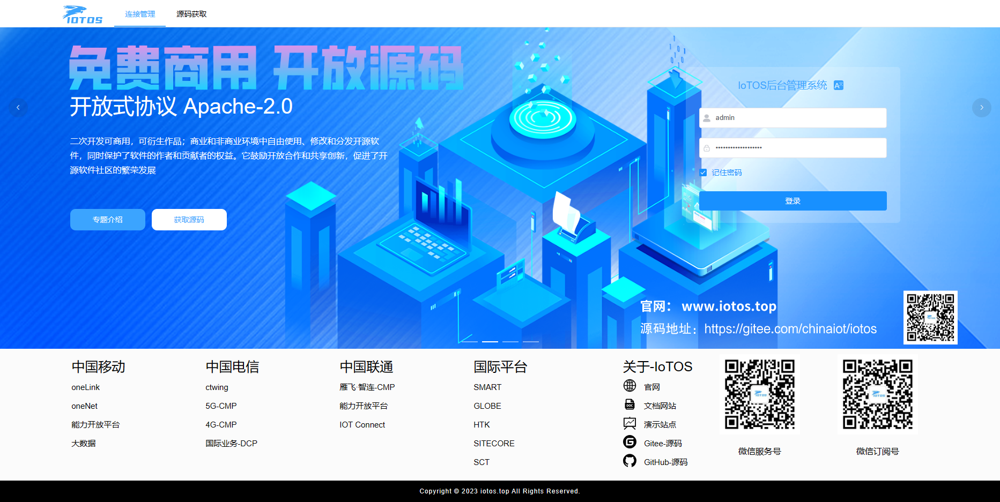

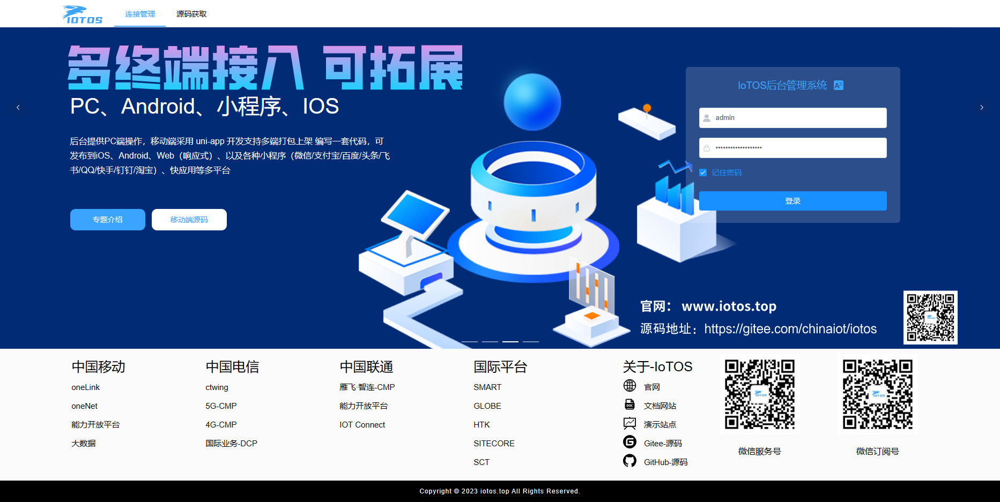

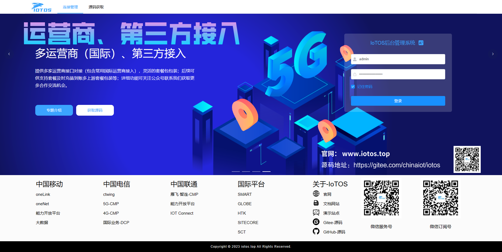

## 首页{#pc-index}

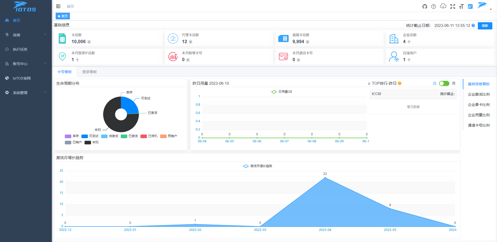

## 通道{#pc-channel}

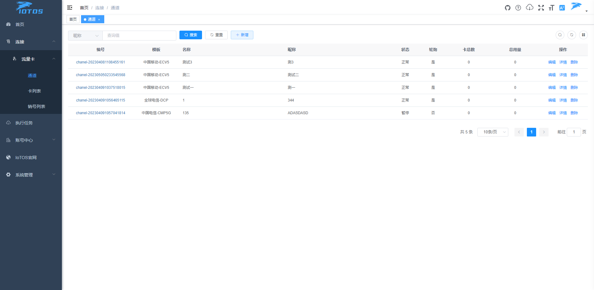

## 卡列表{#pc-card}

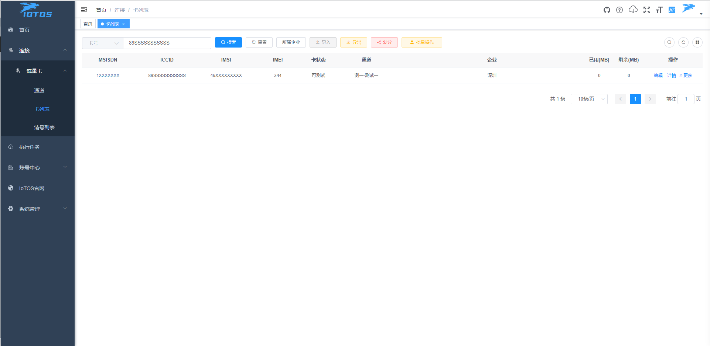

## 卡号详情{#pc-cardInfoUsed}

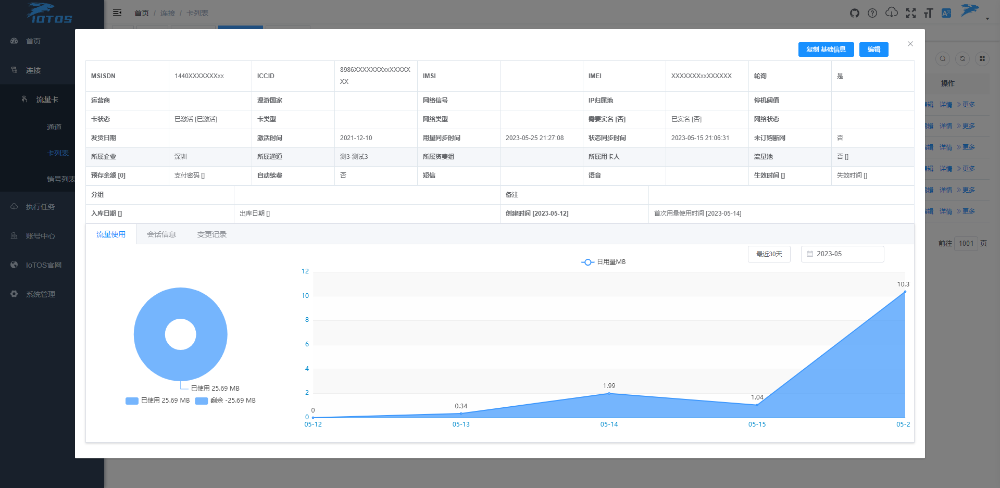

## 业务办理{#pc-businessHandling}

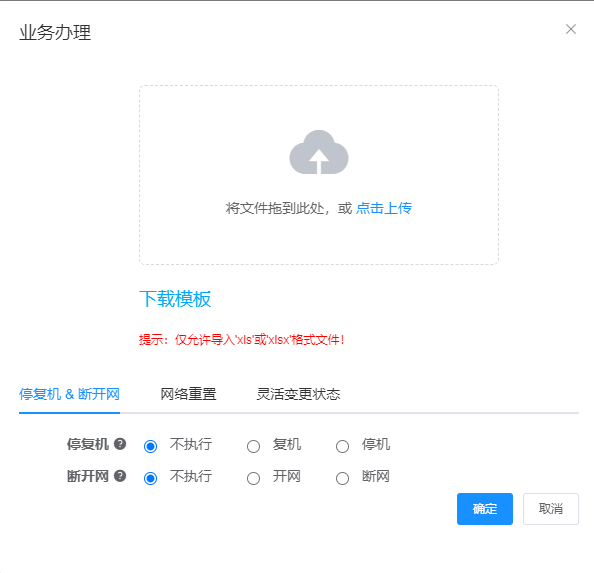

## 执行任务{#pc-task}

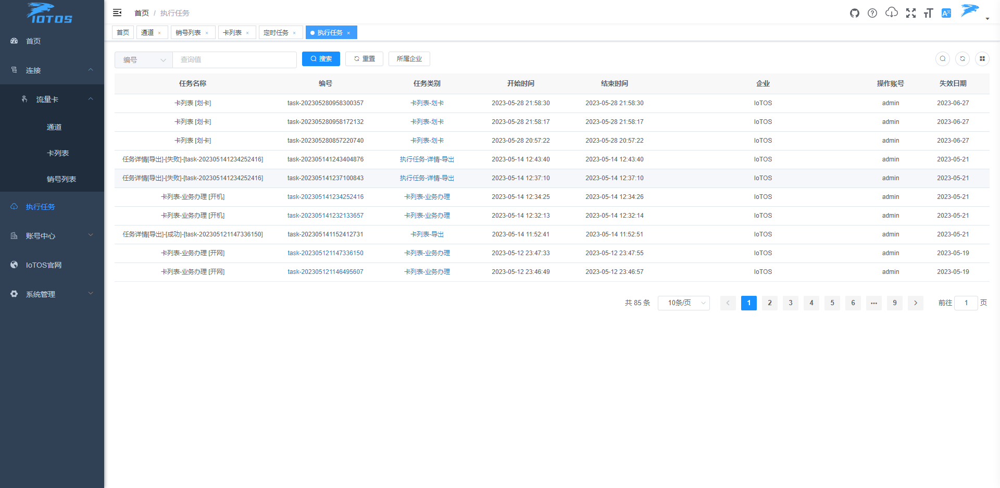

## 执行任务-文件{#pc-taskFile}

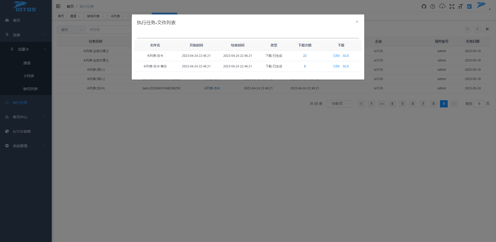

## 执行任务-文件-下载记录{#pc-taskFileDownload}

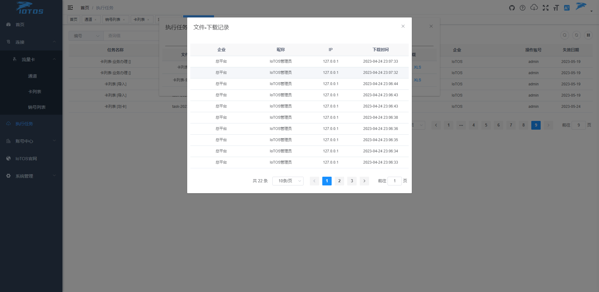

## 划分撤回{#pc-divisionWithdrawn}

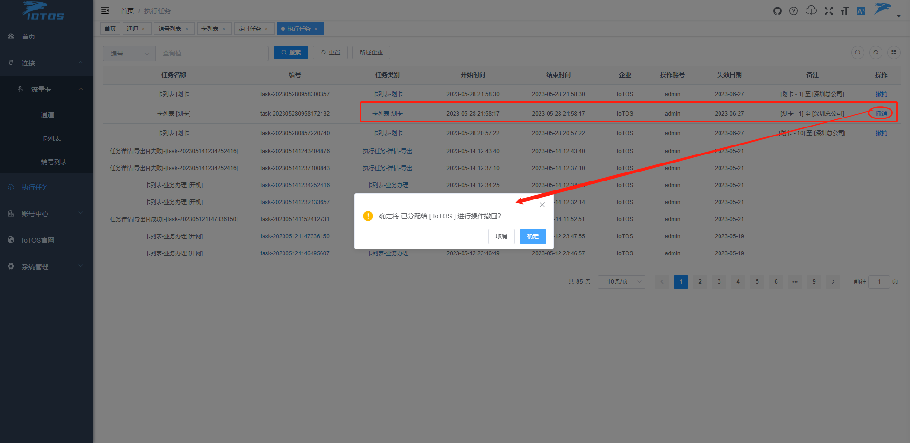

## 国际化语言{#pc-language}

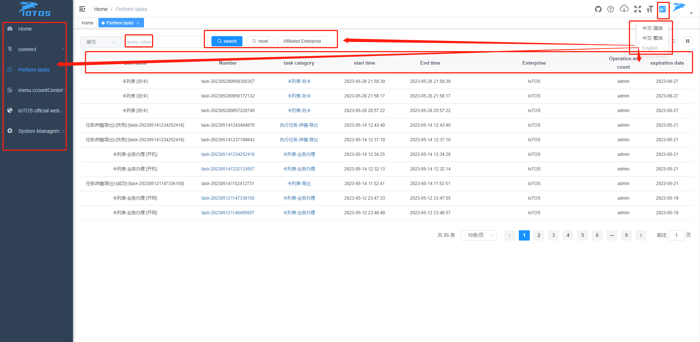

## 关于IoTOS{#pc-IoTOS}

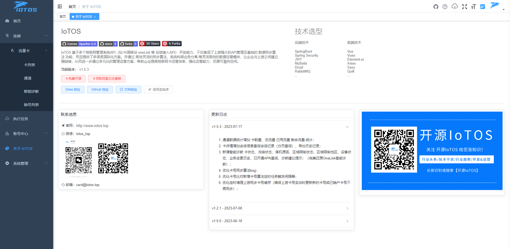

## IoTOS-App 移动端 {#iotos-app}

## 登录页{#app-loginLgChange}

## 工作台{#app-workIndex}

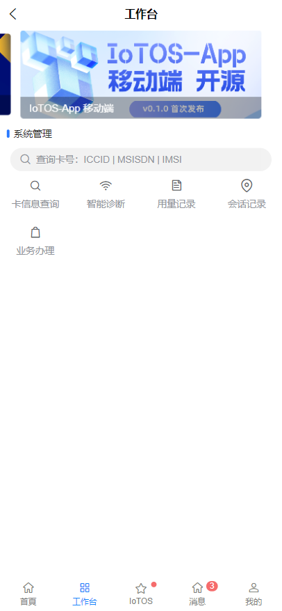

## 我的{#app-my}

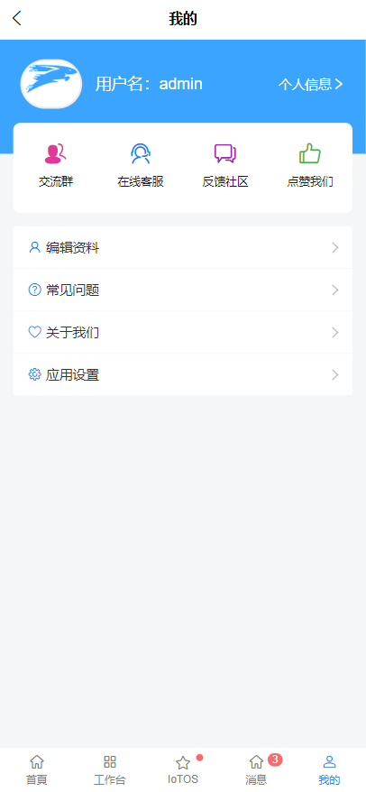

## 语言切换{#app-lgChange}

## 登录公告与通知{#app-notify}

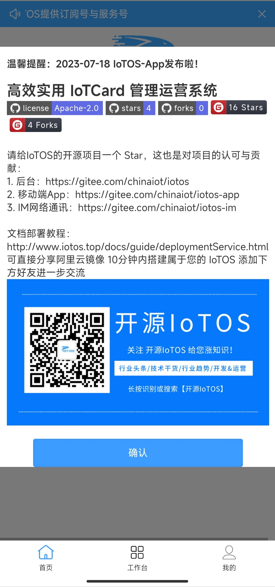

## 卡信息查询{#app-cardInfo_app}

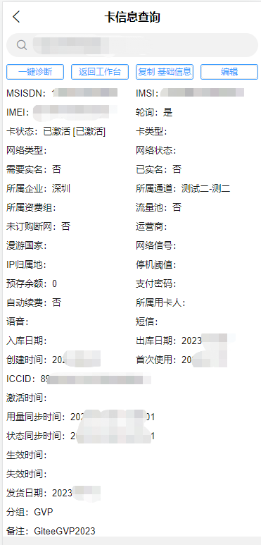

## 会话记录{#app-cardSession_app}

## 智能诊断{#app-diagnosis_app}

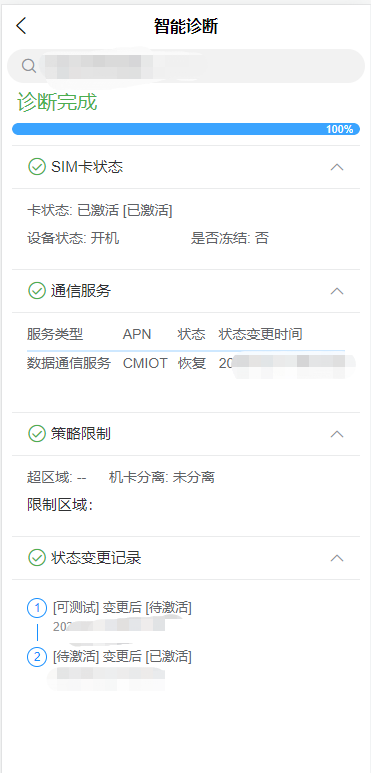

## 用量记录{#app-usedRecord_app}

## 业务办理{#app-cardApiBuinessHandIing_app}

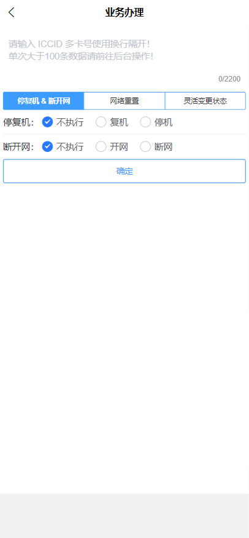

## 通知消息{#app-notify_app}

> 暂未实现 仅完善了单界面ui 

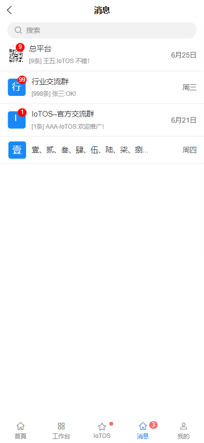
