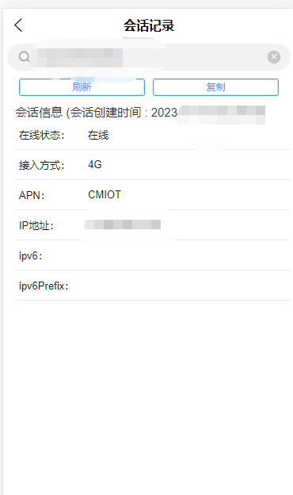

# 项目截图 {#projectDisplay}

## IoTOS PC端 {#iotos-pc}

## 登录页{#pc-login}

## 首页{#pc-index}

## 通道{#pc-channel}

## 卡列表{#pc-card}

## 卡号详情{#pc-cardInfoUsed}

## 业务办理{#pc-businessHandling}

## 执行任务{#pc-task}

## 执行任务-文件{#pc-taskFile}

## 执行任务-文件-下载记录{#pc-taskFileDownload}

## 划分撤回{#pc-divisionWithdrawn}

## 国际化语言{#pc-language}

## 关于IoTOS{#pc-IoTOS}

## IoTOS-App 移动端 {#iotos-app}

## 登录页{#app-loginLgChange}

## 工作台{#app-workIndex}

## 我的{#app-my}

## 语言切换{#app-lgChange}

## 登录公告与通知{#app-notify}

## 卡信息查询{#app-cardInfo_app}

## 会话记录{#app-cardSession_app}

## 智能诊断{#app-diagnosis_app}

## 用量记录{#app-usedRecord_app}

## 业务办理{#app-cardApiBuinessHandIing_app}

## 通知消息{#app-notify_app}

> 暂未实现 仅完善了单界面ui 

