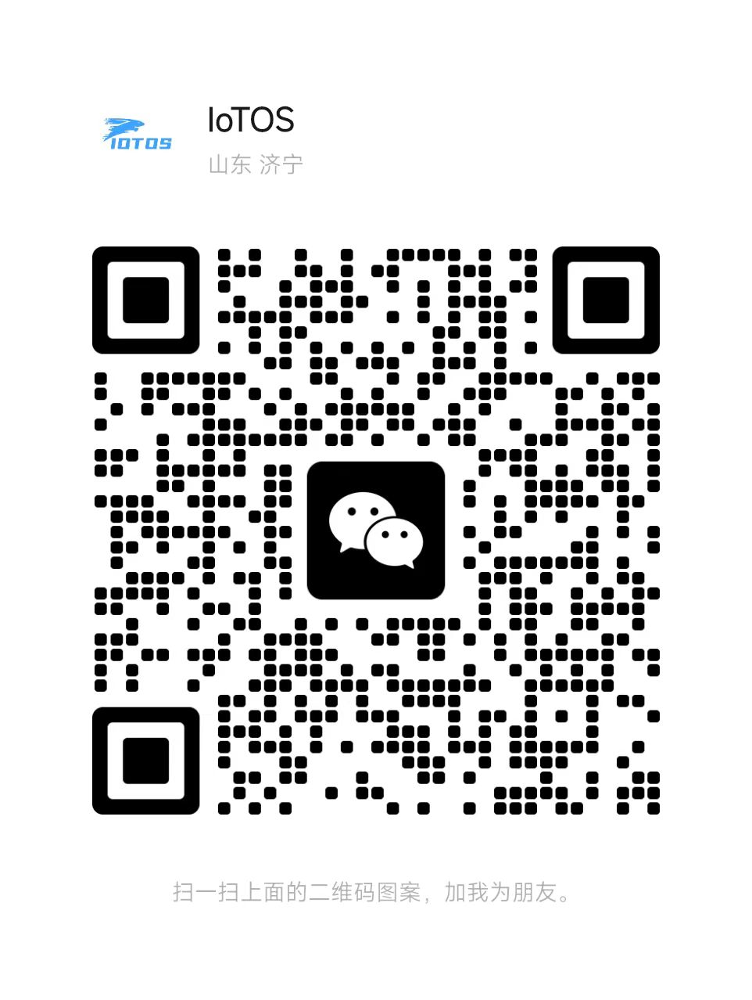

# Become a Sponsor of IoTOS {#become-a-iotos-sponsor}

## Sponsorship Description{#sponsor-description}

IoTOS is an open source project under the Apache-2.0 license and free to use.

If you are a business owner and plan to use IoTOS in your company's business products, long-term donations are welcome.

The business benefits of long-term donations are:

- Active response, fast maintenance and timely update;
- The company name, logo and official website link will be displayed in the open source warehouse, IoTOS official website and publicity materials for a long time;
- The donation amount will be deducted from the price of future paid IoTOS products in the same proportion.

If you are interested in long-term sponsorship of the IoTOS team, or have other good ideas, please contact the development team on WeChat `iotos_top`, or send an email to `card@iotos.top`.

## About Sponsor Level {#sponsor-level}

- **Global Special Sponsor**:
  - Exclusive global sponsor.
  - [iotos.top](/) & [demo.iotos.top](http://demo.iotos.top/) Exclusive logo placement visible above the fold without scrolling.
  - The most prominent position of the logo display at all levels.
- **Platinum Sponsor (998 RMB/month)**:
  - [iotos.top](/) & [demo.iotos.top](http://demo.iotos.top/) The obvious logo display on the homepage.
  - Prominent logo placement on the sidebar of all content pages.
  - In the `README of [`chinaiot/IoTOS`](https://gitee.com/chinaiot/iotos) and [`chinaiot/IoTOS-App`](https://gitee.com/chinaiot/iotos-app) Prominent logo display on .md`.
- **Gold Sponsor (RMB 668/month)**:
  - [iotos.top](/) & [demo.iotos.top](http://demo.iotos.top/) Large logo display on the homepage.
  - In the `README of [`chinaiot/IoTOS`](https://gitee.com/chinaiot/iotos) and [`chinaiot/IoTOS-App`](https://gitee.com/chinaiot/iotos-app) Large logo display on .md`.
- **Silver Sponsor (RMB 258/month)**:
  - `BACKERS in [`chinaiot/IoTOS`](https://gitee.com/chinaiot/iotos) and [`chinaiot/IoTOS-App`](https://gitee.com/chinaiot/iotos-app) Medium size logo display on .md`.
- **Bronze Sponsor (168 RMB/month)**:
  - `BACKERS in [`chinaiot/IoTOS`](https://gitee.com/chinaiot/iotos) and [`chinaiot/IoTOS-App`](https://gitee.com/chinaiot/iotos-app) Small logo display on .md`.
- **Generous supporter (88 RMB/month)**:
  - `BACKERS in [`chinaiot/IoTOS`](https://gitee.com/chinaiot/iotos) and [`chinaiot/IoTOS-App`](https://gitee.com/chinaiot/iotos-app) .md` files, and before the location of other individual supporters.
- **Personal supporter (18 RMB/month)**:
  - `BACKERS in [`chinaiot/IoTOS`](https://gitee.com/chinaiot/iotos) and [`chinaiot/IoTOS-App`](https://gitee.com/chinaiot/iotos-app) .md` files on the list.

## Special Global Sponsor {#special-global-sponsor}

<SponsorsGroup tier="special" placement="page" />

## Platinum Sponsor {#platinum}

<SponsorsGroup tier="platinum" placement="page" />

## Platinum Sponsor (China) {#platinum-china}

<SponsorsGroup tier="platinum_china" placement="page" />

## Gold Sponsor {#gold}

<SponsorsGroup tier="gold" placement="page" />

## Silver Sponsor {#silver}

<SponsorsGroup tier="silver" placement="page" />

## About Sponsorship Funds {#about-sponsorship-funds}

> Sponsorship funds will be invested in the `IoTOS` open source series:

- Expansion of personnel costs, paid software, community building, and accelerated open source progress.
- Demo site server, operating costs, etc. expenses.

## Small Sponsorship {#small-sponsorship}

> After sponsoring, please add WeChat friends and send your `corporate information` or `personal team` Git account avatar, etc. for sponsorship display!

